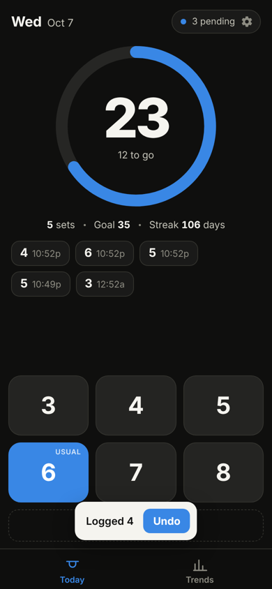
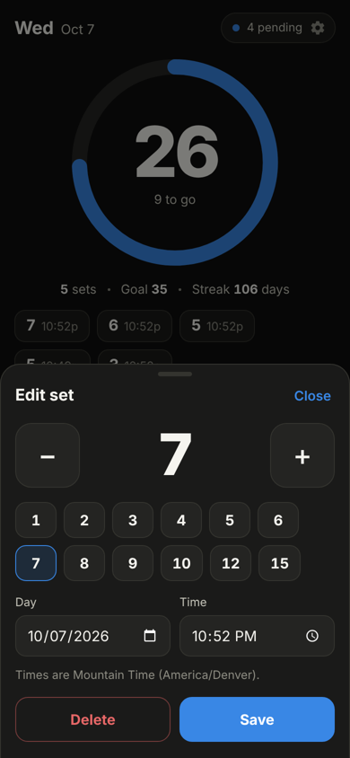
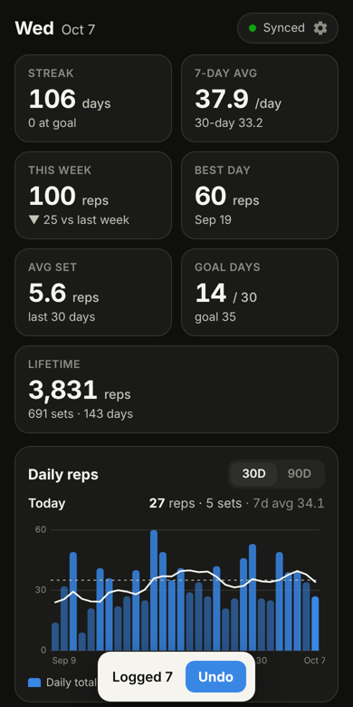
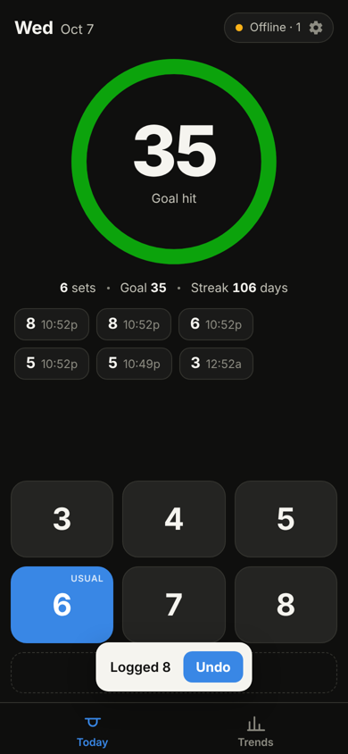

# Pull-ups

A personal pull-up log built for one-handed, one-tap use on a phone. Tap the number you just
did; the day's total updates instantly and syncs in the background. Daily totals, streaks and
trends live one tab over.

<p>
  
  
  
  
</p>

```
 phone / laptop (PWA)                         AWS
┌──────────────────────┐   HTTPS   ┌────────────────────────┐   OAC    ┌──────────────────┐
│ Preact app           │──────────▶│ CloudFront             │─────────▶│ S3: site bucket  │
│ localStorage replica │  /*       │  security headers      │          └──────────────────┘
│ outbox + sync loop   │           │                        │ OAC/SigV4┌──────────────────┐   ┌──────────────────────┐
│ service worker       │──────────▶│  /api/*  (no cache)    │─────────▶│ Lambda (Function │──▶│ DynamoDB: one table  │
└──────────────────────┘ /api/sync └────────────────────────┘          │ URL, AWS_IAM)    │   │ users, sets, day     │
   X-Pullup-Token header  /api/join                                    └──────────────────┘   │ totals, tokens,      │
   (one per device)       /api/invite                                                         │ invites  (PITR on)   │
                                                                                              └──────────────────────┘
```

Each person has their own account and log. People join by invite link, and every set
also feeds per-day totals that a leaderboard can read in one query.

## Deploy

Deploys run from GitHub Actions (`.github/workflows/pipeline.yml`). Every push and PR runs
typecheck, tests, the build, and `terraform validate`. Every push to `main` then runs
`terraform apply`, uploads the site and invalidates CloudFront. No AWS keys are stored in
GitHub. The workflow assumes an IAM role through GitHub's OIDC token, and that role trusts
only `main` of this repo.

### One-time setup (about 5 minutes)

**1. Bootstrap AWS.** This creates the OIDC trust, the deploy role and the Terraform state
bucket from `infra/bootstrap.yaml`. Do it in **AWS CloudShell**, in the region you want
the app in:

```sh
# Upload infra/bootstrap.yaml via CloudShell's Actions → Upload file, then:
aws cloudformation deploy --stack-name pullups-bootstrap \
  --template-file bootstrap.yaml --capabilities CAPABILITY_NAMED_IAM
aws cloudformation describe-stacks --stack-name pullups-bootstrap \
  --query 'Stacks[0].Outputs' --output table
```

(Or use the console: CloudFormation → Create stack → Upload `infra/bootstrap.yaml`, and
tick the IAM acknowledgement.) If the account already has a GitHub OIDC provider, add
`--parameter-overrides CreateOidcProvider=false`. If you rename the repo, also pass
`GitHubOwner=… GitHubRepo=…`.

**2. Add three repository variables.** In the repo, go to Settings → Secrets and variables
→ Actions → **Variables**. These are not secrets; none of them grants access by itself.

| Variable | Value (from the stack outputs) |
|---|---|
| `AWS_ROLE_ARN` | `AwsRoleArn` |
| `AWS_REGION` | `AwsRegion` |
| `TF_STATE_BUCKET` | `TfStateBucket` |

**3. Deploy.** Actions → pipeline → **Run workflow** (or push to `main`). The run summary
prints the app URL. Until the variables exist, the deploy job is skipped, not failed.

**4. Invite yourself.** In CloudShell, upload `scripts/invite.sh` and run
`bash invite.sh new`. It prints a single-use link. On iPhone, open the app URL in Safari,
**Share → Add to Home Screen**, then open the home-screen app and paste the link under
**Settings → Account**. A home-screen app keeps its own storage, apart from Safari's. On
Android or desktop, just open the link and install the app afterwards.

From then on, everything happens inside the app. **Settings → Invite a friend** makes a
link for a new person, and **Add another device** makes a 15-minute link that signs another
device into your own account.

After that, merging to `main` is the deploy. Installed apps pick up a new version on their
next launch.

### What the CI role can do

The deploy role (`github-deploy-pullups`) can only touch resources named `pullups-*`
(site bucket, Lambda, log group) and the `pullups` table, plus CloudFront, which has no useful
resource-level scoping. It can create IAM roles only when they carry the
`pullups-lambda-boundary` permissions boundary. The boundary caps any role it creates at
what the API Lambda needs: item reads and writes on the table, and writing logs. The
deploy role can manage the table but not read or write its items.
Without the boundary, "can create a role and a Lambda" amounts to "can become admin". The
role's own name sits outside the `pullups-*` namespace, so it cannot edit itself.

The table has `prevent_destroy` in Terraform and deletion protection in AWS, so a bad
change can't plan it away, and the deploy role has no `DeleteTable` permission anyway.

### Deploying from a laptop instead

```sh
export AWS_REGION=us-west-2 TF_STATE_BUCKET=<TfStateBucket output>   # plus AWS credentials
scripts/deploy.sh            # check, build, terraform apply, upload, invalidate
scripts/deploy.sh --site     # skip terraform; just rebuild and upload the site
```

This uses the same remote state as CI, so the two never disagree.

**Custom domain** (optional): the domain's zone must be a Route 53 public hosted zone, with
its name servers set at the registrar. Set the repository variables `DOMAIN_NAME` (e.g.
`pullups.example.com`) and `DNS_ZONE_NAME` (`example.com`), and pass the matching
`DnsZoneId` and `DomainName` to the bootstrap stack so the deploy role may edit just those
records. Terraform then issues the us-east-1 ACM certificate, validates it through DNS, and
points A/AAAA alias records at the distribution. Locally, pass the same two values as `-var`s.

## How auth works

There are two independent locks on the API, and no AWS credential ever reaches a browser:

1. **Only CloudFront can call the Lambda.** The Function URL uses `AWS_IAM` auth, and the
   only principal allowed to invoke it is the CloudFront distribution, which signs each
   request with SigV4 through Origin Access Control. Hitting the raw `*.lambda-url…` host
   directly returns 403. (For POST bodies OAC needs the payload hash, so the client sends
   `x-amz-content-sha256`; that's computed with WebCrypto and isn't a secret.)
2. **Only members get past the Lambda.** Every request to `/api/sync` and `/api/invite`
   carries `X-Pullup-Token`, a 256-bit random token issued to that one device when it
   redeemed an invite. The table stores only its SHA-256 digest (`T#<digest>` → user id),
   so a leaked table backup grants no access. The Lambda caches lookups for a minute.

A custom header is used instead of `Authorization` because OAC replaces `Authorization`
with its own signature on the way to the origin.

**Invites.** `POST /api/join { code, name }` is the only unauthenticated route. Codes are
256-bit, single-use, and also stored only as digests. Redeeming one is a single DynamoDB
transaction: it deletes the invite (conditional on it still existing), creates the device
token and, for a friend invite, the new user. Two people racing for one link can't both
win. Friend invites last 7 days and device links 15 minutes. Expiry is checked on redeem;
DynamoDB TTL only tidies up later.

The site bucket is fully private (Block Public Access, owner-enforced objects). The
Lambda's role can only read and write items in the one table.

### Managing access

Run these from AWS CloudShell (upload `scripts/invite.sh`) or anywhere else that has AWS
credentials. They need only the AWS CLI and openssl.

```sh
scripts/invite.sh new            # a friend-invite link (when no one is signed in yet)
scripts/invite.sh users          # list accounts: id and name
scripts/invite.sh device <id>    # lost every device? a link back into that account
scripts/invite.sh revoke <id>    # sign every device of that account out
```

A revoked device stops syncing within 60 seconds and shows **Signed out**. It keeps
logging locally, and those sets are pushed once it signs in again with a device link.

## Data layout and sync

**One DynamoDB table** (on-demand) holds everything. The key layout is documented at the
top of `src/lambda/dynamodb.ts`:

| pk | sk | item |
|---|---|---|
| `U#<userId>` | `P` | profile: name |
| `U#<userId>` | `E#<id>` | one set, plus `serverWrittenAt`, the server time it was written |
| `U#<userId>` | `D#2026-10-08` | that user's day total: reps, sets, best set |
| `T#<digest>` | `T` | device token → user id |
| `I#<digest>` | `I` | pending invite |

Each set is stored as:

```json
{ "id": "9f2c…", "doneAt": 1791489600000, "reps": 6, "updatedAt": 1791489600000 }
```

`doneAt` is when you did the set (it decides the day). `updatedAt` is the version clock.
A deleted set stays as a tombstone with `"deleted": true` so the delete itself can sync.

**No lost writes, by construction.** The entry set is a state-based CRDT: per-entry
last-writer-wins with a deterministic tiebreak (delete beats edit on a same-millisecond tie).
Merging is commutative, associative and idempotent, so devices converge regardless of
order, duplicates or retries. On the server, each pushed set is merged against the stored
version and written with a **conditional put** on that version's `serverWrittenAt`, which strictly
increases per set, so a concurrent writer is always detected. When one is, the Lambda
re-reads, re-merges and retries. A test fires 12 concurrent pushes through an
interleaving store to prove it, and the same suite runs against DynamoDB Local in CI.

**Day totals for the leaderboard.** After writing, the Lambda recomputes the total for
every Denver day a push touched, both the old and new day when a set moves. It sums that
day's sets through the `by-done-at` index and writes the result conditional on the total's
version, so a stale recompute can't overwrite a newer one. Day totals carry `monthPk` =
`M#2026-10`, which puts every user's days for a month in the `by-month` GSI, so a board
for any period is one query. A retried push recomputes even when its sets were already
written, which heals a request that died between the two steps.

**Delta sync.** `POST /api/sync { pushedEntries: Entry[], sinceCursor: <cursor> }` pushes the outbox and
returns every set of yours written after the cursor (queried via the `by-server-written-at` index), plus
a new cursor. The cursor deliberately trails the server clock by 30 s, longer than the
Lambda timeout, so a write that was stamped but still in flight can never slip behind
it. The cost is that a recent write is sent back once more, which the merge ignores. A
fresh device sends `sinceCursor: 0` and gets everything in one round trip.

**Backups.** Point-in-time recovery is on, so the table can be restored to any second
in the last 35 days.

## Offline behavior

- **Every tap is local first.** The entry is written to the in-memory replica and
  `localStorage` synchronously, added to the outbox, and rendered. The network is never
  on the tap path.
- **Taps are batched.** A sync fires 1.2 s after the last change, so a burst of edits is one request.
- **Retries back off** at 2 s, 4 s, 8 s and so on, capped at 5 minutes. A sync is also
  kicked when the app comes to the foreground, when the browser reports `online`, and
  every minute while visible. iOS has no Background Sync API, so these opportunistic
  triggers are what it gets.
- **Edits made during an in-flight sync stay queued.** An entry leaves the outbox only
  if the version the server acknowledged is still the latest local one.
- **The app shell is precached** by a small hand-written service worker, so the app opens
  with no signal at all. The `/api` path is never cached.
- The pill in the top right always says where things stand: *Synced*, *3 pending*,
  *Offline · 3*, *Signed out*, or *Sign in*.
- **Logging works before you join.** Sets logged without an account stay on the device,
  and they're pushed to your account the moment you redeem an invite or device link.

If `localStorage` is wiped, a device link from another of your devices (or from
`invite.sh device`) pulls the full history back. Anything that never synced before the
wipe is gone, which is why the outbox count is always visible.

## Design decisions

**Invite links + per-device tokens, not Cognito or Sign in with Google.** Everyone on the
board is someone a member invited, so there's nothing to recover a password for. A lost
device is fixed with a device link from another device, or from `invite.sh device`. This
keeps the browser side to one header, and the API stays a Function URL behind CloudFront
OAC: it costs nothing idle, it's same-origin (no CORS), and all merge logic runs
server-side where conditional writes make it race-free.

**DynamoDB, not S3.** This started as one JSON file per month in S3, which was ideal for a
single person. A leaderboard needs totals across users, which in S3 means reading every
user's files on every view. In DynamoDB each set is its own item, so a push writes only
what changed and a sync reads only what's new. The per-day totals sit in an index that
answers "everyone's October" with one query.

**Days are computed in America/Denver everywhere**, for every user, regardless of the device's zone, via
`Intl.DateTimeFormat`. Day keys are `YYYY-MM-DD` strings with pure calendar arithmetic, so
the 23- and 25-hour DST days count as one day each. Sets entered by hand
(“Other amount or time…”) take a Denver wall-clock time. A time skipped by spring-forward
moves an hour later, and the repeated fall-back hour resolves to its first occurrence. The
UI rolls over at local midnight even if the app is left open.

**Preact (~4 KB gz) rather than vanilla or React.** The UI has several views, sheets and
derived stats that re-render together. Preact gives components and hooks for the price of
a small image. Bundled with **esbuild**: one dependency, a 40 KB JS / 14 KB CSS build, no
config files.

**Hand-rolled SVG charts, no chart library.** Two charts don't justify a 60+ KB dependency.
The bar chart shows daily totals with the goal as a dashed rule and a 7-day trailing mean
as a line. Tap any bar for a readout, with a legend because there are three marks. The
heatmap uses one sequential blue ramp, bucketed by fraction of your goal, so its colors
mean the same thing however your volume grows.

**Logging UX.**
- **Six big buttons for 3–8** in the bottom thumb zone, since that covers your range.
  Your most frequent count over the last 30 days is highlighted as **usual**.
- **One tap = one logged set**, with haptic feedback where supported and an **Undo**
  toast for 5 seconds.
- **A second tap within 600 ms is ignored.** A real set takes longer than that; a
  fat-finger double-tap doesn't.
- **"Other amount or time…"** opens a stepper with any rep count plus a date/time, for
  odd sets or ones you forgot to log.
- **Tap any of today's set chips to edit or delete it.** Delete has its own undo.
  Past days are editable from **Trends → History**.

**Stats shown.** Today's total against the goal ring is the headline, with set count and
current streak under it. Trends has:
- **Streak**: consecutive days with any sets, plus days at goal. An empty *today* doesn't
  break the streak until midnight.
- **7- and 30-day averages over completed days.** Today's partial total would drag them
  down all morning. Days before your first set aren't counted, so averages are honest from
  day one.
- **This week vs. last week to the same weekday.** Monday to Thursday is compared with
  last Monday to Thursday, not the whole of last week.
- **Best day**, **average set size**, **goal days out of 30**, and **lifetime totals**.
- **A 30/90-day chart, a 26-week heatmap, and a tappable 30-day history list.** The list
  doubles as the accessible table view of the chart data.

**Daily goal is per-device** (default 35). Syncing it would need a second LWW record and
a settings file. It's a one-time setting, so that wasn't worth the extra moving parts.

**Dark-first** (gym lighting, OLED), with a light theme that follows the OS. System
rounded font with tabular numerals, so digits don't jump as totals change.

**Cost.** Effectively zero at this volume. A few hundred Lambda invocations and on-demand
DynamoDB requests a day sit inside the free tiers, and PITR on a table this small is
fractions of a cent.
CloudFront's always-free tier covers it. To bound worst-case cost from someone hammering
the URL with bad tokens, set `lambda_reserved_concurrency` (e.g. `2`). It defaults to off
because new AWS accounts often can't reserve concurrency.

## Development

```sh
npm install
npm run dev        # builds, then serves on http://localhost:5173 with the real API handler
                   # over an in-memory db saved to .devdata/; prints a join link and a
                   # device link for the seeded "Dev" account
npm test           # vitest (DynamoDB adapter tests skip without DYNAMODB_ENDPOINT)

docker run --rm -p 8000:8000 amazon/dynamodb-local
DYNAMODB_ENDPOINT=http://localhost:8000 npm test    # also runs them against DynamoDB Local
npm run typecheck
npm run check      # both
npm run build      # dist/site (static) + dist/lambda/index.js
```

The service worker is skipped on `localhost` so dev reloads aren't served stale.
`scripts/make-icons.py` regenerates the PNG icons (needs Pillow).

### Tests

- `test/time.test.ts`: Denver day boundaries in both offsets, evening sessions that cross
  UTC midnight, month and year edges, both DST transitions, wall-clock → instant conversion.
- `test/stats.test.ts`: daily totals with tombstones, zero-filling, streak rules,
  completed-day averages, week-to-date comparison, best day, empty history.
- `test/model.test.ts`: LWW tiebreaks, commutativity/associativity/idempotence, an edit
  that moves a set across a month boundary, input validation.
- `test/server-sync.test.ts`: delta sync and the cursor lag (including a write that
  commits after a later sync started), day totals through edits, deletes and moves, healing
  a total on retry, **12 concurrent writers losing nothing**, concurrent edit vs. delete,
  stale recomputes, per-user isolation, friend invites and device links (single-use,
  expiry), and bad input.
- `test/dynamodb.test.ts`: the DynamoDB adapter against DynamoDB Local. It covers the
  conditional puts, both LSIs across query pages, the month GSI, concurrent syncs, and
  three people racing to redeem one invite.
- `test/tracker.test.ts`: the client replica. It covers persistence before network,
  debounced batching, an edit during an in-flight push, two devices converging after
  offline edit/delete conflicts, a fresh device pulling history, the cursor and its reset
  on account change, sets logged before joining, undo before first sync, backoff, and
  stopping when signed out.
- `test/handler.test.ts`: the Lambda entrypoint. It covers Function URL events, base64
  bodies, token-lookup caching, and opaque 500s.

## Layout

```
src/shared/   time.ts (Denver calendar), model.ts (entries + CRDT merge), stats.ts
src/lambda/   handler.ts → http.ts (routes) → sync.ts (merge + day totals), accounts.ts (invites)
              → db.ts (interface + in-memory) / dynamodb.ts
src/app/      tracker.ts (local replica + sync engine), api.ts, App/Today/Trends/sheets/charts, sw.ts
src/dev/      local server used by `npm run dev`
infra/        Terraform: site bucket, DynamoDB table, CloudFront + OACs, Lambda + URL
              bootstrap.yaml: one-time CloudFormation for CI (OIDC role, state bucket, boundary)
scripts/      build.mjs, dev.mjs, deploy.sh, tf-init.sh, publish-site.sh, invite.sh, make-icons.py
.github/      pipeline.yml: check on every push/PR, deploy on main
```
